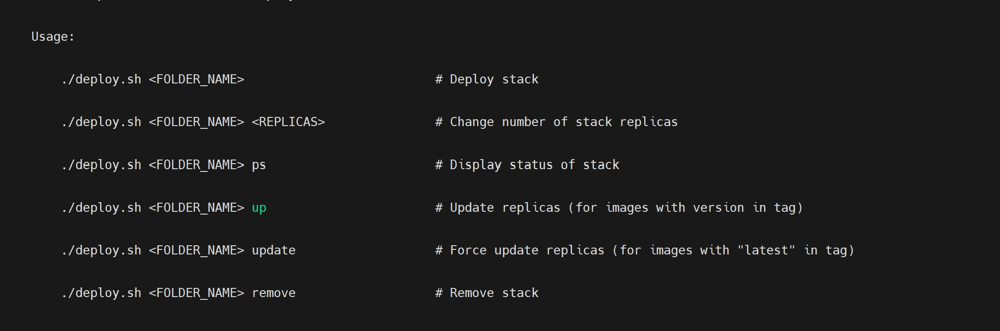

## Docker Swarm Stack Manager

---
A Shell script for managing Docker Swarm deployments with env file efficiently. Simplifies deployment, scaling, updating, and removal of Docker Swarm stacks.

---
### Key Features

- **Deployment Options:** Deploy Docker stacks defined in Docker Compose files
- **Replica Management:** Adjust the number of replicas dynamically.
- **Update and Removal:** Update services with and without image updates, and remove stacks when no longer needed.
- **Status Display:** Check the status of deployed services.

---
### Usage

